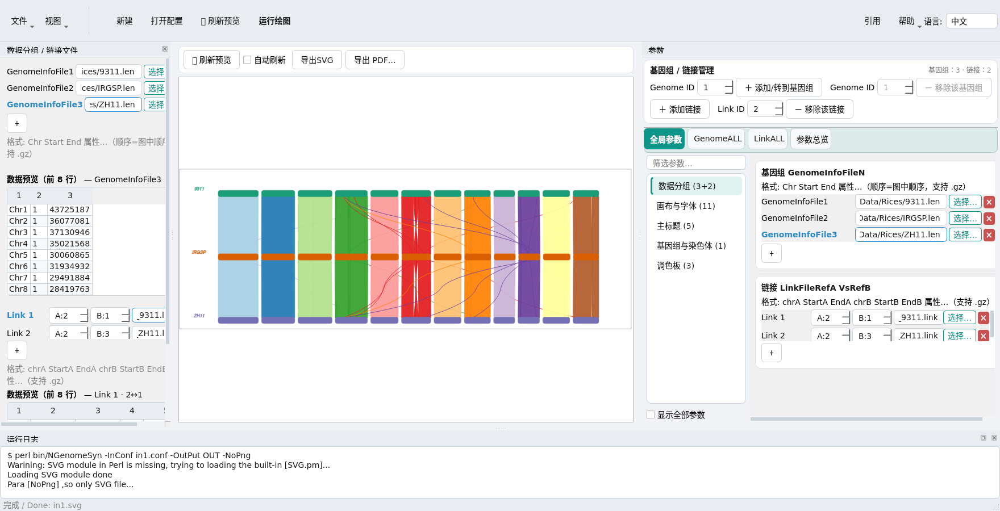

# 
An easy-to-use and flexible tool for pretty visualization of syntenic relationships on any number of genomes

###  1 Introduction

</br>    <p align="center"> 中文的readme有可能是<b>老版本的readme</b>  ,对应最新的使用说明请见对应版本里面的 中文的使用手册pdf   ，or 直接查看英文的readme </p> </br>

<b>NGenomeSyn</b> 是于基于多个基因组共线性关系的可视工具，对多个基因组自主排列位置，扩长收缩，旋转角度 等，结合颜色，达到快速一眼看出规律，识别结果。 并且各种可以自己组合 自由修改相关参数。
</br>
</br>亮点：
</br>1  任意多个基因组(目前我限20个，可以取消)
</br>2  各个基因组可以自己调顺序 颜色等等属性
</br>3  各个基因组可以移动 旋转 扩长和收缩等
</br>4  ZoomRegion功能，可以指定放大某一个区域
</br>
</br>其中3  可以调好相关参数 可以出现 三角形  五角形  四边形 等等组合（后面将有空升组调定这些参数）

</br>程序是给一些有基础的生信朋友用的，若是小白看不懂就算了。
</br>
</br><b>NGenomeSyn</b> ,It is a visual tool based on the collinear relationship of multiple genomes, which independently arranges the positions, expansion and contraction, rotation angles, etc. of multiple genomes, combined with colors, to quickly see the rules and identify the results at a glance. And various can be combined by themselves to freely modify the relevant parameters


###  2 Download and Install
------------
The <b>new version</b> will be updated and maintained in <b>[hewm2008/NGenomeSyn](https://github.com/hewm2008/NGenomeSyn)</b>, please click below website to download the latest version
</br><p align="center"><b>[hewm2008/NGenomeSyn](https://github.com/hewm2008/NGenomeSyn)</b></p>

<b> 2.1. Linux / macOS / Windows&nbsp;&nbsp;&nbsp;   [Download v1.50](https://github.com/hewm2008/NGenomeSyn/archive/v1.50.tar.gz)</b>
  </br> Windows 用户可直接使用图形界面（GUI），需安装 [Perl](https://strawberryperl.com/) 和 [Python 3](https://www.python.org/)。
  
  </br> <b>2.2 Pre-install</b>
  </br> 命令行模式面向 Linux/Unix/macOS，图形界面（GUI）另支持 Windows。安装前请确认已具备以下依赖。
  </br> 1) [Perl](https://www.perl.org/) with the [SVG.pm](https://metacpan.org/release/SVG) in Perl should be installed. SVG is not necessary,We have provided a built-in SVG module in the package.
  </br> 2) [convert](https://linux.die.net/man/1/convert) 命令建议预装，但不是必需的（仅命令行模式使用 svg 转 png 时需要；GUI 自行渲染 PNG 与 PDF）
  </br> 3) 图形界面需要 [Python 3](https://www.python.org/) 与 [PySide6](https://pypi.org/project/PySide6/)。下方启动脚本会在首次运行时自动安装 PySide6（失败时依次尝试 `--user` 与镜像源）；若自行执行 `python gui/main.py`，请先手动运行一次 `pip install PySide6`。

</br> <b>2.3 Install</b>
</br> <b>命令行模式（CLI）：</b>
<pre>
        git clone https://github.com/hewm2008/NGenomeSyn.git
        cd NGenomeSyn;	chmod 755 -R bin/*
        ./bin/NGenomeSyn  -h 
</pre>
  </br> <b>图形界面模式（GUI）：</b>
<pre>
        # Linux / macOS
        sh NGenomeSynGUI.sh
        # Windows
        双击 NGenomeSynGUI.bat     ## 或：python gui\main.py
</pre>
  </br> GUI 仍需 Perl 来运行引擎，与命令行模式相同。Windows 用户可安装
  [Strawberry Perl](https://strawberryperl.com/)，或解压便携版使
  <code>gui_runtime/perl/perl/bin/perl.exe</code> 存在。详见第 7 节图形界面说明。


###  3 图形界面 GUI



NGenomeSyn 提供跨平台图形界面（Windows / Linux / macOS），驱动的是**未经修改的原版 Perl 引擎**，
命令行能出的图，图形界面同样能出，只是参数改为可视化配置。

- **左侧**：上下两个有序数据列表 —— 基因组 `GenomeInfoFile1..N` 与链接
  `LinkFileRefA VsRefB`（链接用 `A:`/`B:` 下拉指定连接哪两个基因组）。
  点击任一行即可预览该文件前 8 行，选中态与右栏同步。
- **中间**：SVG 实时预览，滚轮缩放、拖拽平移，导出 SVG / 高分辨率 PNG / PDF。
- **右侧**：参数页签 `全局参数 · GenomeALL · Genome 1..N · LinkALL · Link 1..M · 参数总览`，
  按 10 个分类浏览。

亮点：
- **66 个参数**，均标注引擎真实默认值与取值范围（由 Perl 源码交叉校验得出），
  其中 **17 个引擎真实读取但官方文档从未提及**；
- **35 个内置 RColorBrewer 调色板**，色条预览后再选；
- **中英双语**界面，跟随系统深色/浅色主题。

运行方式（无需命令行）：

    Linux/macOS:  ./NGenomeSynGUI.sh        （需要 python3；PySide6 首次运行自动安装）
    Windows:      NGenomeSynGUI.bat        （双击即可）

手册：
- [中文 GUI 手册](gui/doc/NGenomeSyn_GUI_manual_Chinese.pdf)
- [English GUI Manual](gui/doc/NGenomeSyn_GUI_manual_English.pdf)

详见 [gui/README.md](gui/README.md)（含引擎说明与打包方式）。


###  4 Parameter description
------------
</br><b>4.1 NGenomeSyn</b>
</br><b>4.1.1 Main parameter</b>

```php
        Usage: NGenomeSyn  -InConf  in.cofi -OutPut OUT

                -InConf      <s> : InPut Configuration File
                -OutPut      <s> : OutPut svg file result

                -help              See more help *Manual.pdf
                                   [hewm2008 v1.50]

```
</br> brief description for function:
<pre>
	   # 用法和circos相似，主要一个配置文件一样,具体见pdf，简要功能介绍如下
	1  任意多个基因组（目前我限12个，可以取消）
	2  各个基因组可以自己调顺序 颜色等等属性
	3  各个基因组可以移动 旋转 扩长和收缩等
	
	其中3  可以调好相关参数 可以出现 三角形  五角形  四边形 等等组合（后面将有空升组调定这些参数）
	   更多[GetTwoGenomeSyn.pl](https://zhuanlan.zhihu.com/p/515695482)参数
</pre>

</br><b>4.1.2 Other parameters</b>
```php
     输入文件基因组格式见  pdf.主要为chr start end 等其它属性 的格式
     输入link件基因组格式见  pdf.主要为chrA  startA enda chrB startB endB   等等其它属性 的格式

```

</br><b>4.2.2 Detail parameters</b>
```php
	#  具体见pdf
##################################### 全局参数 #######################################################
SetParaFor = global
GenomeInfoFile1=RefA.len
###### Format (chr Start End ...其它属性)  chr顺序和这文件一致 若是End Start 则这条chr反向互补
##  其它属性 如fill=red stroke-width=0  stroke=black stroke-opacity=1 fill-opacity=1 等等可以不同行不同属性
GenomeInfoFile2=RefB.len  ##  GenomeInfoFile X  就表示有 X个基因组

LinkFileRef1VsRef2=RefA_RefB.link  

####### Format (chrA StartA EndA chrB StartB End ...其它属性)
#  可以多次Ref1VsRef2   LinkFileRef2VsRef1 等


##Main = "main_Figure"  ##  the Fig Name  :MainRatioFontSize MainCor ShiftMainX  ShiftMainY 
## font-size 

################################ Figure ############################################################

##############################     画布 和 图片 参数配置 #################################
#body=1200   ##   默认是1200，主画布大小设置  另外：up/down/left/right) = (55,25,100,120); #CanvasHeightRitao=1.0 CanvasWidthRitao=1.0
##RotatePng   = 0  ##  对Figure进行旋转的角度

SetParaFor = Genome1  #  GenomeALL/GenomeX  X第X个基因组

#ZoomChr=1.0          ## chr长度 等大 缩小 or 扩大
#RotateChr=30         ## chr的起点 顺时针 旋转  xx 度
#ShiftX=0
#ShiftY=0             ##对这个基因组移动,也可以直接用MoveToX MoveToY 

#ChrWidth=20          ## 这个基因组chr的在画布的宽度
#LinkWidth=180        ## 这个基因组和下一个link的高度
#ChrSpacing=10        ## 这个基因组chr之间的空隙
#NormalizedScale=0    ## 用自己的标尺  相当该基因组与默认的基因组是否等长

#SpeRegionFile=        ## 文件,表记特别区域[格式chr start End （xx=yy加属性等]
#ZoomRegion           ## Zoom the specific Region,format (ZoomRegion=chr2:1000:5000)

##其它当很少用到的参数 EndCurveRadian=3/ 等等
## GenomeNameRatio GenomeName
## 鍧愭爣鏄剧ず鐩稿叧 ShowCoordinates=1     ## Show Coordinates . with other para [ScaleNum=10 ScaleUpDown ScaleUnit LabelUnit  LablefontsizeRatio  RotateAxisText NoShowLabel ]

SetParaFor = Genome2  #  GenomeX  X第X个基因组


SetParaFor=Link1  #  对第X个 Link X  File 进行设置 LinkALL :对所有link起作用
#StyleUpDown=           ## UpDown  DownUp  UpUP DownDown line  五种形式  line为直线
#Reverse=1              ## 反向link
#HeightRatio=1.0        ## links的高比例  扩大or缩小
####  fill/ stroke/stroke-opacity/fill-opacity/stroke-width   可设

....  #等等


```

</br><b>4.3 Output files</b>
<pre>
out.svg: Output plot in SVG format
out.png: Output plot in png format
</pre>


###  5 Examples
------------

</br>See more detailed usage in the&nbsp;&nbsp;&nbsp;&nbsp;&nbsp;&nbsp;&nbsp;&nbsp;&nbsp;&nbsp;&nbsp;&nbsp; <b>[Chinese Documentation](https://github.com/hewm2008/NGenomeSyn/blob/main/NGenomeSyn_manual_Chinese.pdf)</b>
</br>See more detailed usage in the&nbsp;&nbsp;&nbsp;&nbsp;&nbsp;&nbsp;&nbsp;&nbsp;&nbsp;&nbsp;&nbsp;&nbsp; <b>[English Documentation](https://github.com/hewm2008/NGenomeSyn/blob/main/NGenomeSyn_manual_English.pdf)</b>
</br>See the example directory and  Manual.pdf for more detail.
</br>具体见这儿  Manual.pdf for more detail 里面的实例和配置，后期将在某些网址释放一些教程
</br></br> 
../../bin/NGenomeSyn       -InConf        in.cofi -OutPut OUT
</br>  目录  <b> [[Example/example\*/](https://github.com/hewm2008/NGenomeSyn/tree/main/Example)] </b>　里面有输入和输出和脚本用法。

</br> 如下提供了6个实例，均用到真正的数据作的图。


|  <b>Example</b>               |                                                 <b>Description</b>                                                |
|-------------------------------|-------------------------------------------------------------------------------------------------------------------|
|  <i><b>example1</b></i>       |   An integrating <b>pipeline</b> and processing data and visualizing of two genomes for the simplest usage        |
|  <i><b>example2</b></i>       |   Horizontal layout of 3 or more genomes,  genome layout adjustment and special region <b>highlight</b>           |
|  <i><b>example3 </b></i>      |  Link settings, five link styles, genome layout adjustment for particular shape (triangle)                        |
|  <i><b>example4</b></i>       |  <b>ZoomRegion</b> function of local <b>gene structure</b>(CDS mRNA) collinearity                                 |
|  <i><b>example5</b></i>       |  The comprehensive configuration for horizontal layout of more than three genomes (>3)  |
|  <i><b>example6</b></i>       |  quick identification of genetic deletion in some breeds (pan-genome frequently analysis) to <b>solve biological</b> problems |


</br>

所有测试数据均来自真实数据，我们将其放在[[Example/RealData](https://github.com/hewm2008/NGenomeSyn/tree/main/Example/RealData)]目录下，并且
文件 (00.ReadMe)j里面有列到数据的 下载的URL


* Example 1)两个基因组默认
最简易，默认居中。  run2.sh里面有流程 


* Example 2) 三个(N个)基因组默认 


* Example 2)三个(N个)基因组默认  排列 旋转等
旋转 第三个基因组


* Example 3)三个(N个)基因组默认  排列 旋转等
UpUp DownDown和三角型作图


* Example 4)  任意排列

有数据可以出下图


* Example 5)  局部基因结构共线性和ZoomRegion功能


* Example 6) 泛基因组学演常用分析，查看品种之间的插入和缺失，寻找生物意义


</br> In fact, NGenomeSyn is not only designed for the visualization of genomic synteny and genomic features, but also for other relationships among any data with a similar input format. For example, a user ([lian xu et 2022](https://www.nature.com/articles/s41597-022-01783-8)) used NGenomeSyn for visualization clusters with similar gene expression patterns (generated by Mfuzz software) between other four datasets and the reference dataset and revealed conserved expression patterns of differential expression genes among different datasets.


###  6 Advantages

</br>速度快，少内存
</br>可以自我定义组合多层次
</br>有perl即可以运行，免安装
</br>GUI v1.50

### 7 Discussing
------------
- [:email:](https://github.com/hewm2008/NGenomeSyn) hewm2008@gmail.com / hewm2008@qq.com
- join the<b><i> QQ Group : 125293663</b></i>

### 8 Citation
------------
please cited this [article](https://doi.org/10.1093/bioinformatics/btad121) if possible
</br>Weiming He, Jian Yang, Yi Jing, Lian Xu, Kang Yu, Xiaodong Fang, NGenomeSyn: an easy-to-use and flexible tool for publication-ready visualization of syntenic relationships across multiple genomes, Bioinformatics, 2023;, btad121, https://doi.org/10.1093/bioinformatics/btad121
######################swimming in the sky and flying in the sea #############################
